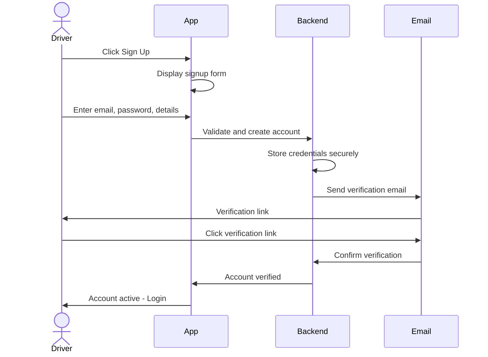
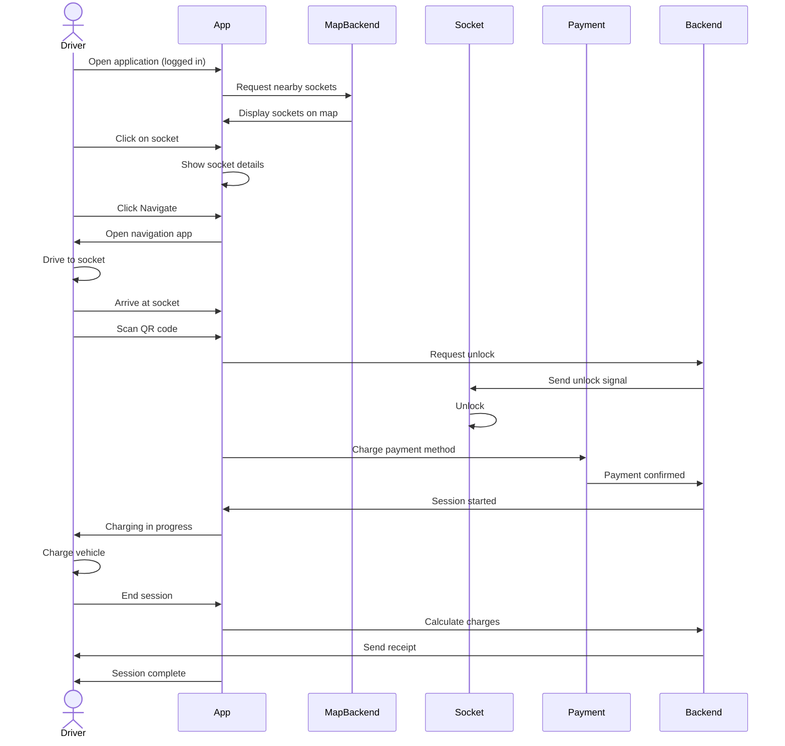

# Design Specifications For Locate-A-Socket

## Revision History

| Name            | Date       | Reason For Changes                     | Version |
| --------------- | ---------- | -------------------------------------- | ------- |
| Joshua Kempster | 21/01/2026 | Initial Draft of stories and use cases | 0.1     |
| Joshua Kempster | 21/01/2026 | Shorten use cases and stories          | 0.2     |

## User Stories

| ID    | Role                 | Story                                                                                                                                                    |
| ----- | -------------------- | -------------------------------------------------------------------------------------------------------------------------------------------------------- | --- |
| US.1  | Driver               | As a driver, I want to know the location, price and charging speed of a socket, so that I can compare it to others and decide whether to navigate to it. |     |
| US.2  | Support staff/Admin  | As support staff, I want to see user interaction data, so that I can help the customer use the application .                                             |
| US.3  | Product/Data Analyst | As an analyst, I want to see user interaction data, so that I can understand and address pain points.                                                    |
| US.4  | Driver               | As a driver, I want to easily get support for an issue, so that I can solve my problem and return to using the service quickly.                          |
| US.5  | Socket supplier      | As a socket supplier, I want to ensure that my socket information is up to date, so that I can provide the correct service to users.                     |
| US.6  | Driver               | As a driver, I want to easily make and log in to an account, so that I can keep my personal information saved for each transaction or interaction.       |
| US.7  | Driver               | As a driver, I want to be assured that my information is kept safe, so that my identity and capital is not threatened                                    |
| US.8  | Company executive    | As a company executive, I want to ensure there are no security breaches, so that the viability and reputation of the company is not affected             |
| US.9  | Driver               | As a driver, I want the application to be available whenever I need to charge my vehicle, so that I am not left stranded without a socket.               |
| US.10 | Driver               | As a driver, I want to easily and reliably make payments online, so that I can interact with a socket entirely from within the app.                      |
| US.11 | Socket supplier      | As a socket supplier, I want to receive payments, so that I can offer the customer the charging service.                                                 |

## Use Cases

### UC.1 – Making an Account

Primary Actor: Driver | Secondary Actor: Signup Backend\
Description: Drivers must sign up to use the application. They can create an account by entering their email and password.\
Basic Flow:

1. Driver provides email and password
2. Driver accepts the terms of service and privacy policy
3. System validates email and password, and creates account
4. Driver verifies email
5. Account is active

### UC.2 – Logging into an Account

Primary Actor: Driver | Secondary Actor: Account Backend\
Description: Drivers can log in to their already created account.\
Basic Flow:

1. Driver enters email and password
2. System validates credentials
3. Driver is authenticated and redirected to the main map view

### UC.3 – Logging out of an Account

Primary Actor: Driver | Secondary Actor: Account Backend\
Description: Drivers can log out of their account.\
Basic Flow:

1. Driver clicks Log Out
2. Session is terminated and driver is redirectedtto the login screen

### UC.4 – Adding Payment Details

Primary Actor: Driver | Secondary Actor: Data Backend\
Description: Drivers need to pay to use a socket, so they must be able to add and remove payment details.\
Basic Flow:

1. Driver navigates to payment settings
2. Driver enters payment details
3. System validates and securely stores them

Alternative Flow:

2. Driver clicks "Remove Payment Method" next to the relevant payment method they want to remove
3. System removes specified payment method

### UC.5 – Browsing, Navigating to and Using Sockets

Primary Actor: Driver | Secondary Actor: Data Backend\
Description: Drivers can use the map interface to browse the sockets near them (or anywhere on the map) and navigate to them. They can then unlock, charge and pay, all from the app. Nice to have: toggle for a list interface; search function by name or address.\
Basic Flow:

1. System displays sockets on map with location and details
2. Driver can zoom, filter, and click for detailed information
3. Driver selects socket and clicks Navigate
4. System offer options: use in-app navigation, open in Google Maps, Apple Maps, or Waze
5. System provides turn-by-turn navigation via in-app or redirects to external app
6. Driver arrives at socket and scans QR code or location is detected
7. System holds payment method and sends unlock signal
8. Socket is unlocked and charging begins, with progress visible in the app
9. When charging is complete, payment method is charged based on information received from the socket

### UC.6 – Contacting Support

Primary Actor: Driver | Secondary Actor: Support staff\
Description: Drivers can contact support directly from the app, using chat or phone function. This provides the support staff with information about their current and recent activity within the application.\
Basic Flow:

1. Driver clicks support button
2. System displays chat or phone options
3. Driver connects with support staff with account context

### UC.7 – Viewing Transactions

Primary Actor: Driver | Secondary Actor: Data backend\
Description: Drivers can view transaction details and receipts.\
Basic Flow:

1. Driver navigates to transaction history
2. System displays transactions sorted by date
3. Driver can view full details and receipts

### UC.8 – Updating Socket Information

Primary Actor: Socket supplier | Secondary Actor: Socket backend\
Description: Socket suppliers can update socket information via a supplier dashboard.\
Basic Flow:

1. Supplier logs into dashboard
2. Supplier selects and updates socket information
3. System validates and saves changes to driver-facing application

## Sequence Diagrams

### Flow 1: Account Creation

### Flow 2: Browse, Navigate to, and Use a Socket

## Interface

## References

See accompanying SRS document – 2.1P.
